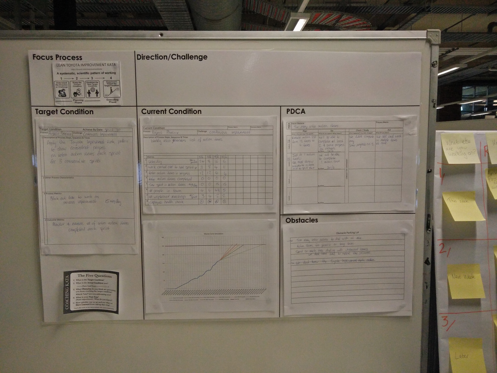

# Improvement Kata
Resources supporting the Improvement Kata pattern for continuous improvement

## What is the Improvement Kata
The "Toyota Kata" published by Mike Rother describes a four stage pattern for continuous improvement supported by continuous coaching. 
For more information see (http://www-personal.umich.edu/~mrother/Homepage.html)

Example Storyboard presented at [LAST Conference 2016](http://lanyrd.com/2016/lastconf/) Poster Sessions

Toyota Kata demo recorded at DevOps Meetup

## Contents
* Storyboard_A1.pdf - A blank story board with sections to place A4 story board sheets. Suitable for laminating as a white board.
* StoryboardSheets.xlsx - A4 sheets for Target and Current Condition in both vertical and horizontal layouts.
* PDCA.xlsx - An A4 PDCA sheet with slightly reduced margins to provide more space for writing.

### Copyright Information

These materials were adapted from the original work by [Mike Rother](http://www-personal.umich.edu/~mrother/Homepage.html)

You are free to share and adapt these materials as long as you credit this source and the [CC-BY-NC license](https://creativecommons.org/licenses/by-nc/4.0/), but the materials (and adapted materials) may not be reproduced for sale in any form.
